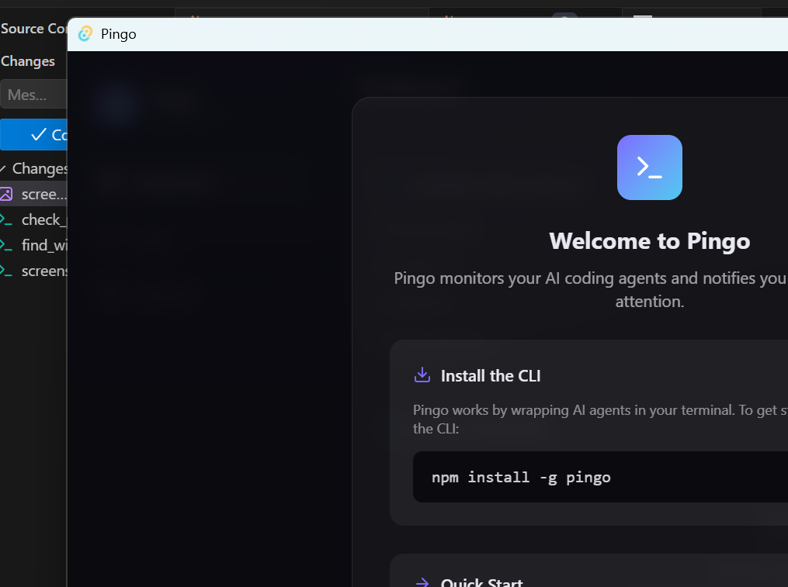

# Pingo

Monitor AI coding agents (Claude Code, OpenCode, Aider, Gemini CLI, Codex, …)
and get notified when they finish, need approval, hit errors, or need
authentication — with native OS notifications and sounds. Fully local, no OCR,
no cloud, agent-agnostic.

## Installation

### Prerequisites

- **Node.js** v18 or later ([download](https://nodejs.org))

### Install the CLI

```bash
npm install -g pingo
```

Verify it works:

```bash
pingo --version
```

### Desktop app (optional)

Download the latest installer from the
[Releases](https://github.com/ankitsharmagit/Pingo/releases) page:

| Platform | Installer |
| -------- | --------- |
| Windows  | `Pingo_*.msi` or `Pingo_*_Setup.exe` |
| macOS    | `Pingo_*.dmg` |
| Linux    | `Pingo_*.AppImage` |

Launch the app — it auto-connects to your CLI wrapper. No configuration needed.



> **Windows SmartScreen**: Since Pingo is not yet code-signed, Windows may
> show a SmartScreen warning. Click **More info** → **Run anyway** to proceed.
> Pingo is open source and the source code is available for inspection.

> The CLI installs in one command (`npm install -g pingo`). The desktop app
> installers are built automatically via CI on every tagged release.

## Usage

Run any AI agent through Pingo:

```bash
pingo claude          # monitor Claude Code
pingo opencode        # monitor OpenCode
pingo aider           # monitor Aider
pingo gemini          # monitor Gemini CLI
pingo codex           # monitor Codex CLI
```

Pingo wraps the agent, passes all I/O through to your terminal, and analyzes
every line for events. You'll hear notification sounds and see alerts
immediately.

### Without the desktop app

Notifications work using your system sounds and text-to-speech. Configure them:

```bash
pingo setup
```

### With the desktop app

Keep the desktop app running in the background for a rich dashboard, tray
icon, event history, and custom sounds per event category.

## Commands

| Command | Description |
| ------- | ----------- |
| `pingo <agent>` | Launch and monitor an AI agent |
| `pingo setup` | Configure notification mode (voice, sound, both, none) |
| `pingo doctor` | Diagnose your setup — CLI version, audio, desktop connectivity |
| `pingo test` | Send a test notification to verify your config |
| `pingo --version` | Show installed version |

## Notification modes

```
pingo setup
```

- **sound** — plays system notification sounds (default)
- **voice** — speaks alerts via text-to-speech
- **both** — sound + voice
- **none** — silent (terminal output only)

Without the desktop app, Pingo uses your system sounds and TTS. With the
desktop app running, notifications are richer (custom sounds, tray icon, event
history).

## Rules

Pingo monitors agent output for these events:

| Event | Example triggers |
| ----- | ---------------- |
| Permission Required | "waiting for approval", "press Enter to continue" |
| Task Completed | "completed", "all changes applied" |
| Authentication | "login required", "token expired" |
| Error | "error", "fatal", "exception" |
| Rate Limit | "rate limit", "quota exceeded", "429" |

Rules are fully customizable. With the desktop app, edit them in the Rules tab.

## Architecture

```
Agent → pingo CLI → terminal (passthrough)
                 → desktop app (WebSocket) → notification + sound + log
```

The CLI wrapper launches your agent, streams its output to the terminal
untouched, and analyzes every line against detection rules. If the desktop app
is running, events are sent over a local WebSocket; otherwise, Pingo handles
notifications itself using your system's sound and voice capabilities.
