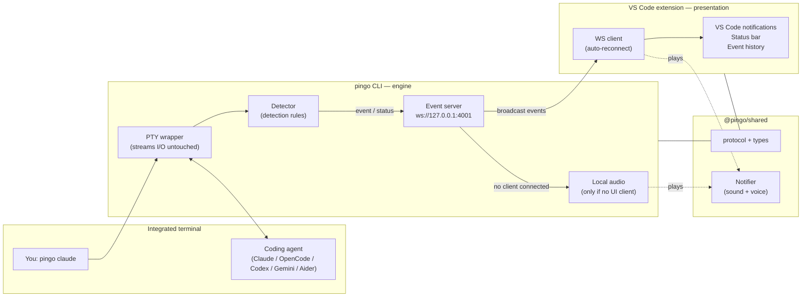

# Pingo Architecture

Pingo is split into three workspaces. The **CLI is the engine and single source
of truth**; the **VS Code extension is a thin presentation layer**; a **shared
package** keeps the wire contract and notifier identical across both.



## Components

### `cli/` — `pingo`
- Spawns the agent inside a pseudo-terminal so interactive TUIs see a real TTY.
- Streams output to your terminal **untouched** while analyzing it line-by-line
  with the detector (`cli/src/detector.ts`).
- Hosts a `WebSocketServer` on `127.0.0.1:4001` and **broadcasts** every detected
  event and status change to subscribers.
- Plays sound/voice locally **only when no UI client is connected**, so it's fully
  useful standalone but never double-notifies when VS Code is attached.
- Multi-instance: the first `pingo` binds the port; later instances fall back to
  local-audio-only mode.

### `packages/shared/` — `@pingo/shared`
- `types.ts` — `PingoEvent`, `StatusUpdate`, `EventType`, and friendly label/emoji
  maps.
- `protocol.ts` — `WS_PORT`, `WS_URL`, the `{ type, data }` message envelopes, and
  a safe parser.
- `notifier.ts` — cross-platform sound + voice playback (Windows PowerShell /
  macOS `afplay`+`say` / Linux `paplay`+`spd-say`), serialized through queues.
- `sounds/` — the bundled WAV alert assets.

### `vscode-extension/` — Pingo for VS Code
- A WebSocket **client** that auto-reconnects to the CLI every 2s.
- Renders native VS Code notifications (approval → warning, completed → info,
  error → error), a status bar item, and an event-history QuickPick.
- Persists history in `globalState`. **No detection, no terminal parsing.**

## Event flow

1. `pingo claude` spawns Claude in a PTY and starts the event server on `:4001`.
2. The detector matches a line (e.g. a permission prompt) and emits an event.
3. The CLI broadcasts `{ type: "event", data: PingoEvent }` to every client.
4. The extension receives it → VS Code notification + sound/voice + history.
5. If no extension is connected, the CLI plays the sound/voice itself.

## Wire protocol

Server → client messages on `ws://127.0.0.1:4001`:

```jsonc
{ "type": "hello",  "data": { "agent": "Claude", "pid": 1234, "version": "1.0.0" } }
{ "type": "status", "data": { "agent": "Claude", "pid": 1234, "status": "waiting", "startTime": "…", "lastActivity": "…" } }
{ "type": "event",  "data": { "agent": "Claude", "type": "permission", "message": "Do you want to make this edit?", "priority": "high", "timestamp": "…" } }
```
