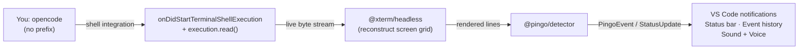
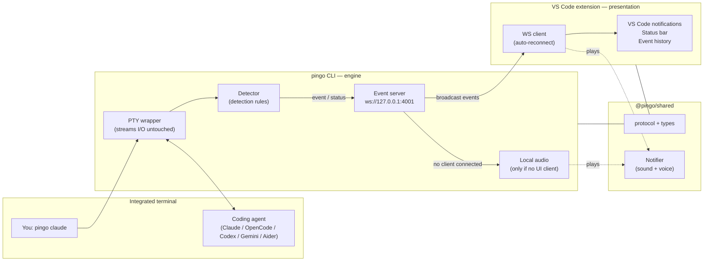

# Pingo Architecture

Pingo's **primary product is the VS Code extension**. Install it and keep using
your agents exactly as before — `claude`, `opencode`, `codex`, `gemini`,
`aider`, with **no `pingo` prefix**. The extension passively monitors the
integrated terminals via VS Code's stable Shell Integration API, reconstructs
each agent's full-screen TUI with a headless terminal emulator, and runs the
shared detection engine over the rendered screen. No CLI, no localhost service,
and no WebSocket are required for this default path.

The **`pingo <agent>` CLI is an optional fallback** for shells/terminals where
shell integration isn't available; the extension subscribes to it over a
localhost WebSocket only when `pingo.useCliFallback` is enabled. A **shared
detector** (`@pingo/detector`) and **shared protocol/notifier** (`@pingo/shared`)
keep detection and notifications identical across both paths.

## Passive monitoring (default path)



`vscode-extension/src/monitor.ts` matches the command against the known agents,
skips any `pingo …` wrapper (owned by the fallback path), pumps `read()` chunks
into a per-execution emulator, and — once the screen settles — serializes the
visible buffer and detects on each line, de-bounced to avoid repaint spam.

## Claude Code extension bridge

The Claude Code **VS Code extension** runs `claude` in its own shell-less
pseudoterminal, so Shell Integration never fires for it and passive monitoring
can't see it. Claude Code's first-class **hooks** are the supported signal: the
extension hosts an in-process localhost listener (`hookServer.ts`), and the
command **"Pingo: Enable Claude Code Integration"** merges an HTTP hook into
`~/.claude/settings.json` (`claudeSetup.ts`):

```jsonc
{ "hooks": {
  "Notification": [{ "hooks": [{ "type": "http", "url": "http://127.0.0.1:4100/hook" }] }]
}}
```

`Notification` (with `notification_type` `permission_prompt` / `idle_prompt`)
maps to `permission` / `input`. Each POST becomes the same `PingoEvent` the rest
of the extension consumes. No CLI, no WebSocket.

Only `Notification` is registered — Claude Code's `Stop` hook fires on *every*
turn completion, which is too noisy to alert on, so it's intentionally omitted
(the hook server still maps `Stop` → `success` if a user adds it manually). The
goal is to ping you only when Claude actually needs you.

## Optional CLI fallback

The `pingo <agent>` engine below is unchanged; it remains a fully standalone way
to run Pingo and plays its own audio when no extension is connected.



## Components

### `cli/` — `pingo`
- Spawns the agent inside a pseudo-terminal so interactive TUIs see a real TTY.
- Streams output to your terminal **untouched** while analyzing it line-by-line
  with the detector (`cli/src/detector.ts`).
- Hosts a `WebSocketServer` on `127.0.0.1:4001` and **broadcasts** every detected
  event and status change to subscribers.
- Plays sound/voice locally **only when no UI client is connected**, so it's fully
  useful standalone but never double-notifies when VS Code is attached.
- Multi-instance: the first `pingo` binds the port; later instances fall back to
  local-audio-only mode.

### `packages/detector/` — `@pingo/detector`
- The rule-based detection engine: `Detector`, `DEFAULT_RULES`, `stripAnsi`.
- Pure, dependency-free, and shared by **both** the extension's passive monitor
  and the CLI, so detection behaves identically wherever it runs.

### `packages/shared/` — `@pingo/shared`
- `types.ts` — `PingoEvent`, `StatusUpdate`, `EventType`, and friendly label/emoji
  maps.
- `protocol.ts` — `WS_PORT`, `WS_URL`, the `{ type, data }` message envelopes, and
  a safe parser.
- `notifier.ts` — cross-platform sound + voice playback (Windows PowerShell /
  macOS `afplay`+`say` / Linux `paplay`+`spd-say`), serialized through queues.
- `sounds/` — the bundled WAV alert assets.

### `vscode-extension/` — Pingo for VS Code (primary product)
- Passively monitors integrated terminals (`monitor.ts`) via the Shell
  Integration API, reconstructs each agent's TUI with `@xterm/headless`, and runs
  `@pingo/detector` over the rendered screen — so agents are detected with **no
  `pingo` prefix**.
- Renders native VS Code notifications (approval → warning, completed → info,
  error → error), a status bar item (`$(bell) Pingo Active`), and an
  event-history QuickPick. Persists history in `globalState`.
- Optionally also subscribes to the CLI's WebSocket server when
  `pingo.useCliFallback` is enabled; events from both sources are de-duplicated.

## Event flow

1. `pingo claude` spawns Claude in a PTY and starts the event server on `:4001`.
2. The detector matches a line (e.g. a permission prompt) and emits an event.
3. The CLI broadcasts `{ type: "event", data: PingoEvent }` to every client.
4. The extension receives it → VS Code notification + sound/voice + history.
5. If no extension is connected, the CLI plays the sound/voice itself.

## Wire protocol

Server → client messages on `ws://127.0.0.1:4001`:

```jsonc
{ "type": "hello",  "data": { "agent": "Claude", "pid": 1234, "version": "1.0.0" } }
{ "type": "status", "data": { "agent": "Claude", "pid": 1234, "status": "waiting", "startTime": "…", "lastActivity": "…" } }
{ "type": "event",  "data": { "agent": "Claude", "type": "permission", "message": "Do you want to make this edit?", "priority": "high", "timestamp": "…" } }
```
